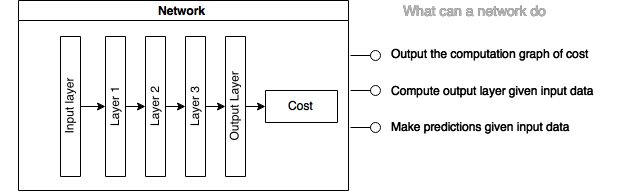
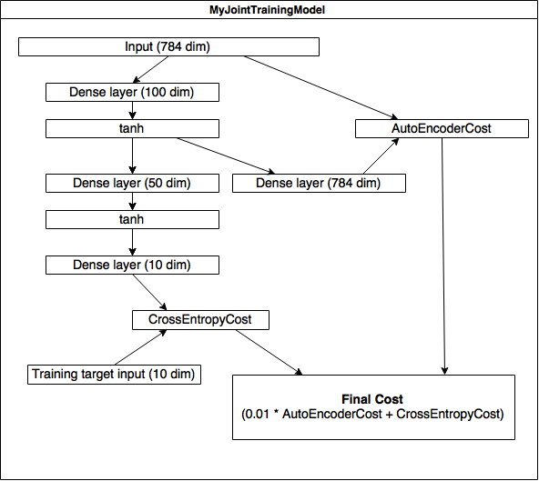

# Tutorial 2: Create your own model

## Understand model definition in deepy

### Network and layers

...

### The example in tutorial 1

...

## Define a model joint-training an auto-encoder and a classifier

In tutorial 2, we try to implement a model contains an auto-encoder,
 and feed the hidden representation to a multi-layer neural network to classify MNIST digits.

### Model architecture

### Implementation notes

- Dense layer
 - AKA fully-connected layer

---

[Full code of this example can be found here](https://github.com/uaca/deepy/blob/master/experiments/tutorials/tutorial2.py)

